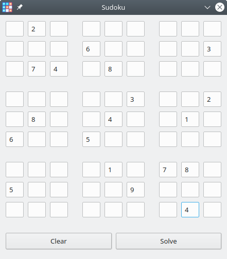

# Sudoku
A simple sudoku solver.



## Build
```
mkdir build
cd build
cmake ../ -DCMAKE_BUILD_TYPE=Release
make
```
## Install
```
sudo make install
```
## Credits
Icons made by <a href="https://www.flaticon.com/authors/vignesh-oviyan" title="Vignesh Oviyan">Vignesh Oviyan</a> from <a href="https://www.flaticon.com/" title="Flaticon"> www.flaticon.com</a>
